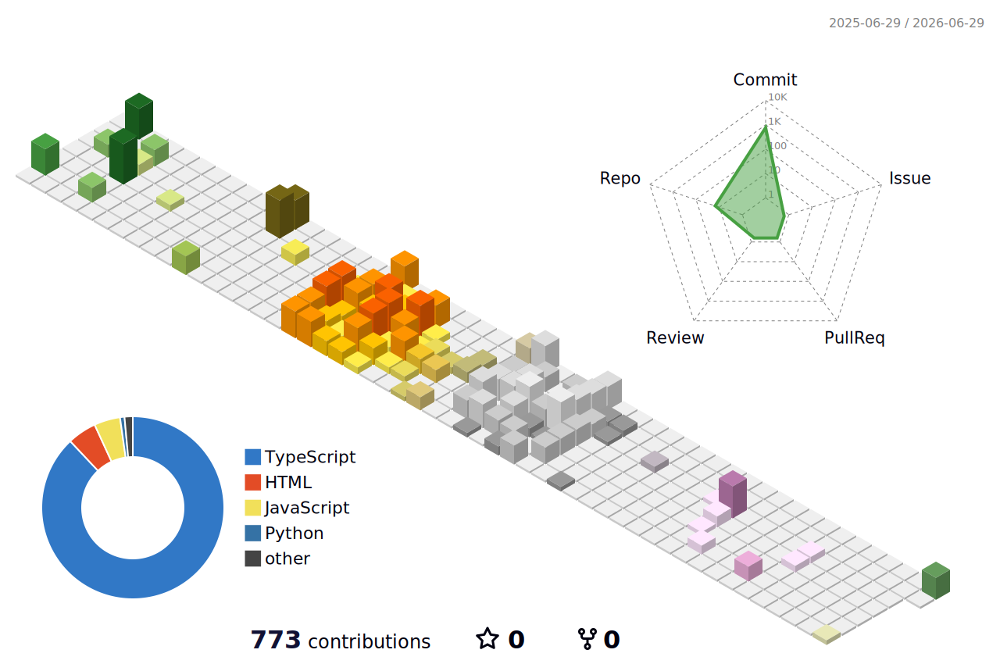

# Camilo Guapacha

**Full Stack Developer · DevOps / Infraestructura**
Construyo la aplicación y la infraestructura que la sostiene.

[Portafolio](https://portafolio-v3-delta.vercel.app) ·
[LinkedIn](https://www.linkedin.com/in/camilo-guapacha-a6732b270/) ·
[Correo](mailto:juancamilog9911@gmail.com)

---

## Perfil

Desarrollador Full Stack que construye productos completos, de la interfaz al
servidor que los sirve. No solo escribo la aplicación: también levanto y
administro la infraestructura donde corre.

Trabajo a diario con TypeScript en todo el stack, llevo sistemas SAAS a
producción de extremo a extremo y opero la infraestructura real que los
sostiene. Tecnólogo en Análisis y Desarrollo de Software (SENA); inicio
Ingeniería de Sistemas y Computación en la UTP en agosto de 2026.

## Tecnologías

| Área | Stack |
| --- | --- |
| **Frontend** | Next.js, React, TypeScript, Tailwind CSS, shadcn/ui |
| **Backend** | Node.js, NestJS, Express, Prisma, MySQL |
| **DevOps / Infraestructura** | Docker, Proxmox, Ubuntu Server, Certbot / SSL, Cloudflare, Git |
| **IA** | Integración de agentes de IA y automatización |

## Experiencia actual

Como desarrollador de planta en una empresa de software del sector financiero,
construyo plataformas SAAS en producción: gestión de RR. HH. multiempresa,
procesos judiciales, gestión presupuestal e integraciones de seguridad social,
además de la integración de agentes de IA dentro de los productos.

El detalle técnico de cada proyecto está en el
**[portafolio](https://portafolio-v3-delta.vercel.app)**.

## Actividad en GitHub

  
  

  

  

  

  

